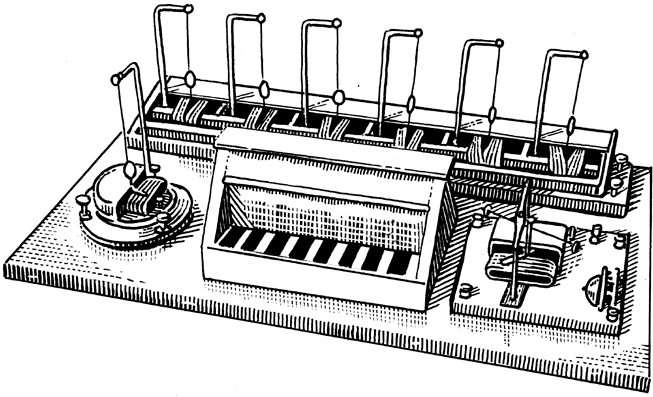

## Description

The main aim this library it's simplify the creation process any telegram's bots.


## Using

The library helps you work flexible and put your business logic to both special objects: __filters__ 
and __handlers__.

### Filters

The library contains some special filters for base aims of telegram's bots, but you can always 
create your own filters, you just implement `TelegramFilter` interface.

#### Message filter

Message filter serves in order to process `MessageHandler` classes which contains business 
logic to handle __*Messages*__ from telegram's chats.

#### CallbackQuery filter

CallbackQuery filter serves in order to process `CallbackQueryHandler` classes which contains 
business logic to handle __*CallbackQueries*__ from telegram's chats.

#### Poll filter

Poll filter serves in order to process `PollHandler` classes which contains business logic to handle 
__*Polls*__ from telegram's chats.

#### PollAnswer filter

PollAnswer filter serves in order to process `PollAnswerHandler` classes which contains business 
logic to handle __*PollAnswers*__ from telegram's chats.

#### Cancel filter

Cancel filter serves in order to reset any state your application and start again. For these goals 
every filter has special method __*clear*__ which helps you take care of resetting any states.

#### Unresolved filter

Unresolved filter serves in order to notice that your application does not understand chat's command.


### Handlers

#### Message handlers

In order to create one of them you need to implement `MessageHandler` interface and to put 
your business logic.

For instance:

```kotlin
@Component
class GeneratorKeyHandler : MessageHandler {
	override fun getCommands(): Map<String, String> = mapOf("/generate_key" to "Generation of key")

	override fun getSteps(): Map<String, MessageHandlerStep<*>> = listOf(
		object : MessageHandlerStep<Int> {
			override fun getKey(): String = "length"

			override fun getQuestion(): MessageQuestionBlock = {
				TextSendMessage(chatId = it.message.chat.id, text = "What length?")
			}

			override fun getValidation(): MessageValidationBlock<Int> = {
				try {
					abs(it.text!!.toInt())
				} catch (e: Exception) {
					throw IllegalArgumentException("Incorrect length format")
				}
			}

			override fun getNextStepKey(): String = "two"
		}
	).associateBy { it.getKey() }

	override fun getInitialStepKey(): String = "length"

	override fun getProcess(): MessageProcessBlock = { message, answers ->
		val length = answers["length"] as Int
		val key = (1..length)
			.map { Random.nextInt(0, 9) }
			.joinToString("")
		TextSendMessage(chatId = message.chat.id, text = "Generated key: $key")
	}
}
```

#### CallbackQuery handlers

In order to create one of them you need to implement `CallbackQueryHandler` interface and to put
your business logic.

For instance:

```kotlin
@Component
class CallbackTestHandler : CallbackQueryHandler {
	override fun getCommands(): Map<String, String> = mapOf("/yes" to "Answer yes")

	override fun getProcess(): CallbackQueryProcessBlock = { callbackQuery ->
		val key = Random(1000).nextInt().toString()
		TextSendMessage(chatId = callbackQuery.message!!.chat.id, text = key)
	}
}
```

#### Poll handlers

In order to create one of them you need to implement `PollHandler` interface and to put
your business logic.

For instance:

```kotlin
@Component
class PollHandlerTest : PollHandler {
	override fun getProcess(): PollProcessBlock = { poll -> 
		TODO("Any logic")
	}
}
```

#### PollAnswer handlers

In order to create one of them you need to implement `PollAnswerHandler` interface and to put
your business logic.

For instance:

```kotlin
@Component
class PollAnswerHandlerTest : PollAnswerHandler {
	override fun getProcess(): PollAnswerProcessBlock = { pollAnswer ->
		TODO("Any logic")
	}
}
```

## Setting up

```
telegram.bot.access-token =                      # api key (required)

telegram.admin.enabled = false                   # enabling admin mode (optional, default is false)
telegram.admin.chat-id = 0                       # admin telegram chat for monitor exception (optional)
  
telegram.filters.message.enabled = true          # optional, default is true
telegram.filters.callback-query.enabled = true   # optional, default is true
telegram.filters.poll.enabled = true             # optional, default is true
telegram.filters.poll-answer.enabled = true      # optional, default is true
telegram.filters.unresolved.enabled = true       # optional, default is true
telegram.filters.cancel.enabled = true           # optional, default is true

telegram.filters.cancel.commands = "/cancel:cancel"   # list of commands (optional, default is /cancel:cancel)
                                                      # format - /<command>:<description of command>
```

## Architecture


